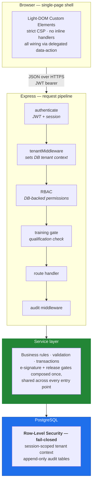

# PharmaComply Hub 360 — Architecture Case Study

> A multi-tenant **GxP quality-management platform** for pharmaceutical manufacturing.
> Electronic batch records, deviations, CAPA, QC laboratory, training management, and a
> 21 CFR Part 11-compliant audit trail across every module.

  
  
  
  
  

> [!NOTE]
> **The source code is private.** This repository is a public architecture write-up of a
> closed-source compliance product. It documents design decisions, threat model, and
> engineering trade-offs — no proprietary source, credentials, schemas, or customer data.

---

## The problem

Pharmaceutical manufacturing is one of the most heavily regulated software environments that exists. A quality-management system in this space must satisfy, at minimum:

- **21 CFR Part 11** (US FDA) — electronic records and electronic signatures
- **EU GMP Annex 11** — computerised systems
- **21 CFR 211** — current good manufacturing practice for finished pharmaceuticals

In practice that means three properties ordinary CRUD apps don't need:

1. **Every state change is attributable, permanent, and reviewable.** Who changed what, from what to what, when, and why — retained for seven years, never edited, never deleted.
2. **Signatures are cryptographically bound to intent.** An approval is not a boolean column; it's a re-authenticated act with a recorded meaning.
3. **Controls cannot be bypassed by the client.** If the UI can skip a gate, the gate does not exist as far as an inspector is concerned.

Bugs here are not bugs. They are **findings** — and findings stop shipments.

---

## Scale

| | |
|---|---:|
| Database tables | 149 |
| SQL migrations | 160 |
| API route modules | 49 |
| Service modules | 95 |
| Frontend components | 38 |
| Test files | 312 |
| Lines of JavaScript | ~140,000 |
| Commits | 1,100+ |

---

## Architecture

### Layered, not clever

Routes are an HTTP shell only — parse, authorise, delegate, respond. All business logic and every database query live in the service layer. This separation is what makes the compliance gates testable in isolation and impossible to route around.

---

## Engineering decisions worth explaining

### 1. Tenant isolation is enforced by the database, not by discipline

The obvious approach is `WHERE company_id = $1` in every query and a code review to catch omissions. That fails eventually — one forgotten clause is a cross-tenant data leak in a regulated system.

Instead, isolation is enforced by **PostgreSQL Row-Level Security**, configured **fail-closed**: the application connects as a role *without* `BYPASSRLS`, and each request sets a session-scoped tenant context. A query that forgets its tenant predicate returns **zero rows** rather than another customer's data. Application-level scoping still exists — but as defence in depth, not as the control.

Background jobs, which have no request context, run through an explicit `runAsSystem` wrapper. That makes "this code path intentionally crosses tenants" a visible, greppable, reviewable decision instead of an accident.

**Trade-off:** RLS costs measurable latency on hot paths, and one performance-critical query was left application-scoped after review. That exception is documented rather than silently made — which is the actual compliance requirement.

### 2. The audit trail is a schema constraint, not a convention

Every create, update, and delete writes an audit row containing actor, action, before-state, after-state, and timestamp. Two design details make it hold up:

- **Module names are constrained by a database CHECK.** A new module that forgets to register itself fails loudly at insert time instead of silently filing rows under `SYSTEM` where no reviewer would ever find them.
- **Audit writes are ordered relative to the transaction commit deliberately**, so a failed business transaction cannot leave a phantom audit row claiming something happened that didn't.

This was learned the expensive way. An early version mapped a child record's ID into the audit row while the review panel queried by parent ID — the writes succeeded, the trail looked complete, and the panel showed nothing. Silent audit failure is worse than loud failure, because it's discovered during an inspection rather than during testing.

### 3. Electronic signatures re-authenticate

A Part 11 signature must be the deliberate act of an identified person. Every signature point re-verifies the signer's password against their own credential hash, records the **meaning** of the signature (approve / reject / verify / release), and writes signature and business change **in a single transaction** — so a signature can never exist without its record, or the reverse.

Four-eyes enforcement is server-side: the signer is checked against the originator, and self-approval is rejected and *logged as an attempt*.

A subtle failure found in review: rejecting a wrong signature password returned `401`, which the API client interpreted as an expired session and logged the user out mid-approval. Signature rejection now returns `403` — `401` means *session*, never *signature*. Small distinction, large usability and audit difference.

### 4. Quality gates are composed once and shared

Batch release is reachable from more than one endpoint. Early on, each carried its own copy of the release conditions — and the copies drifted, so one path enforced gates the other didn't.

The fix was to extract a single assertion used by every release entry point, and — the part that matters — to **test the composition**, proving that all paths reject an identical blocked batch identically. Testing each path separately would have passed while the bug was live.

This generalised into a working rule: **when two computed values must agree, test the agreement, not just each side.**

### 5. Strict CSP forced a better frontend

The application runs with `script-src-attr 'none'`. Inline `onclick` handlers are silently discarded by the browser — and, critically, **jsdom does not reproduce this**, so unit tests pass while the real UI is dead.

All interaction is therefore delegated through `data-action` attributes bound at a single root. The rule that followed: **frontend changes require verification in a real browser.** Playwright runs against an isolated clone of the production schema on a separate port and database, so end-to-end tests exercise real gates against real data without touching anything live.

---

## Testing strategy

| Layer | Tool | What it proves |
|---|---|---|
| Unit | Jest (mocked pool) | Business rules, validation, gate logic |
| Frontend | Jest + jsdom | Render output, escaping, null-safety |
| Integration | Jest + live test database | RLS behaviour, migrations, audit writes |
| End-to-end | Playwright, isolated DB clone | Real-browser workflows, CSP, e-signature paths |
| CI | GitHub Actions | Full suite on every pull request and merge |

Test databases are enforced as separate from development by a global setup guard — the suite **refuses to run** against the development database rather than trusting the environment to be configured correctly.

---

## Security posture

- Parameterised queries **only** — no string-concatenated SQL anywhere
- Secrets exclusively from environment; none in source
- `bcrypt` password hashing, TOTP two-factor authentication, account lockout
- Session lifecycle with idle timeout, concurrent-session control, and forced logout
- SAML 2.0 and OIDC single sign-on with per-tenant identity-provider configuration and encrypted secrets at rest
- Helmet security headers, strict CSP, per-route rate limiting
- Role-based access control backed by a database permission table, not hardcoded role strings

Security reviews are run against the codebase on a recurring basis; findings are tracked to closure with remediation branches rather than accumulating in a backlog.

---

## What I'd tell you in an interview

The interesting engineering here isn't any single feature — it's that **the compliance controls are structural**. Tenant isolation is a database property. Audit completeness is a constraint. Signature validity is a transaction boundary. Gate enforcement is a shared function with a composition test.

Anything enforced only by convention eventually isn't enforced at all. In a regulated domain you find that out during an inspection, which is the most expensive possible time to find it out.

---

Architecture write-up by <a href="https://github.com/Atul12345mandal">Atul Mandal</a>. Source code is proprietary and not included in this repository.
